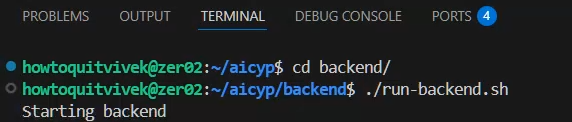
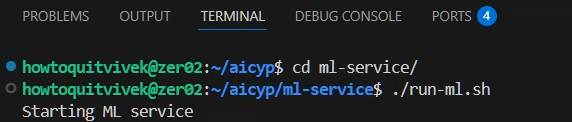
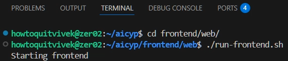

# Crop Yield Prediction & Optimization


This project originates from **Smart India Hackathon (SIH) 2025**.

It aims to design and develop an AI-driven system for **crop yield prediction and agricultural optimization**. The solution is intended to assist farmers, researchers, and policymakers by providing data-informed insights that improve productivity, resource utilization, and decision-making.

The system is expected to address challenges such as:

- Predicting crop yield using historical and real-time data
- Identifying factors affecting agricultural output
- Optimizing input resources (water, fertilizers, soil management)
- Supporting sustainable and efficient farming practices

Here is a **cleaner version with minimal headings**, suitable for a README.

---

## System Prerequisites

Before running the project locally, ensure the following tools are installed:

**Git**

```bash
sudo apt install git
git --version
```

**Java (JDK 17)** – required for the backend

```bash
sudo apt install openjdk-17-jdk
java -version
```

**Node.js (18 or later)** – required for the frontend

```bash
curl -fsSL https://deb.nodesource.com/setup_18.x | sudo -E bash -
sudo apt install nodejs
node -v
npm -v
```

**Python (3.10 or later)** – required for the ML service

```bash
sudo apt install python3 python3-venv python3-pip
python3 --version
```

---

## Running the Project

Each service in the repository contains its own startup script.
Run them in **separate terminals** during development.


<details>
<summary>Backend :</summary>

</details>

```bash
cd backend
./run-backend.sh
```

<details>
<summary>ML Service :</summary>

</details>

```bash
cd ml-service
./run-ml.sh
```

<details>
<summary>Frontend :</summary>

</details>

```bash
cd frontend/web
./run-frontend.sh
```

Running services separately is recommended during development because it allows independent restarts, easier debugging, and clearer logs.

---

## Development Preview Script

A helper script is also available at the repository root:

```bash
./dev.sh
```

This script starts the backend, ML service, and frontend together to quickly preview the application. For active development, running the services individually (as shown above) is recommended.


## License
This project is licensed under the MIT License. See the LICENSE file for details.